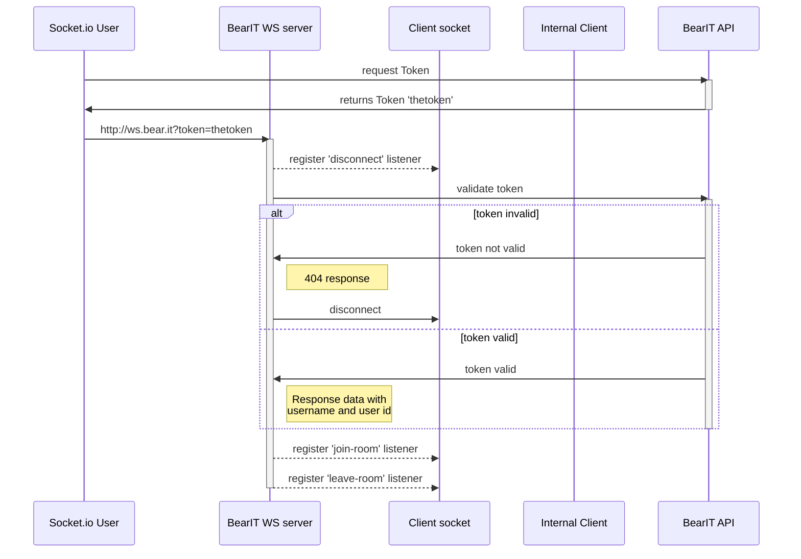

# BearIt

## How does this work

### Connection event

```mermaid
sequenceDiagram

  participant U as Socket.io User
  participant WS as BearIT WS server
  participant S as Client socket
  participant WSC as Internal Client
  participant B as BearIT API

  U ->> B: request Token
  activate B
  B ->> U: returns Token 'thetoken'
  deactivate B

  U ->> WS: http://ws.bear.it?token=thetoken
  activate WS
  WS -->> S: register 'disconnect' listener
  WS ->> B: validate token
  activate B
    alt token invalid
      B ->> WS: token not valid
      Note right of WS: 404 response
      WS ->> S: disconnect
    else token valid
      B ->> WS: token valid
      Note right of WS: Response data with<br>username and user id
    end
  deactivate B

  WS -->> S: register 'join-room' listener
  WS -->> S: register 'leave-room' listener

  deactivate WS
  
```