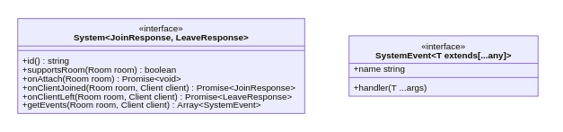

# BearIt

## How does this work

### Connection event


### Joining room


### Leaving room


### Room system

Room system is a component system that is registered in the server instance. It must implement System interface.



example:

```ts

interface MyRoomJoinResponse {
  currentState: string
  someOtherField: int
}

class MyRoomSystem implements System<MyRoomJoinResponse, void> {
  id(): string {
    return 'my-room-system'
  }

  supportsRoom(room: Room): boolean {
    return room.id === 'my-room'
  }

  getEvents(room: Room, client: Client) {
    // Here return system events what will be registered on the socket like {room.id}/some-event

    return [
      {
        name: 'some-event',
        handler: (arg1, arg2) {
          room.emit<[string]>('some-room-event', `${arg1} and ${arg2} were passed!`)
        }
      } as SystemEvent<[string, int]>
    ]
  }

  async onAttach(room: Room): Promise<void> {
    // make some initialization of the room
    // like adding newUserJoined/left listeners 
    // to the room
  }

  async onClientJoined(room: Room, client Client): Promise<MyRoomJoinResponse> {
    // If client expects some initial data you should return it here.
    // In the callback function client will get this data in:
    /*
      {
        'my-room-system': {
            currentState: 'Awesome state',
            someOtherField: 42
        }
      }
    */

   return {
     currentState: 'Awesome state',
     someOtherField: 42
   }
  }

  async onClientLeft(room: Room, client: Client): Promise<void> {
    // similar as onClientJoined, but for this system we are returning nothing beacause we extend
    // System<MyRoomJoinResponse, void> - the second type is for this method
  }
}

```

Joining room from socket.io client example

```js
socket.emit('join-room', { roomId: 'my-room' }, (state) {
  console.log(state)
});

/*
{
  'my-room-system': {
      currentState: 'Awesome state',
      someOtherField: 42
  }
}
*/
```

Emitting room system message from socket.io client

```js
const roomName = 'my-room';
const systemEvent = 'some-event';
socket.emit(`${roomName}/${systemEvent}`);
```